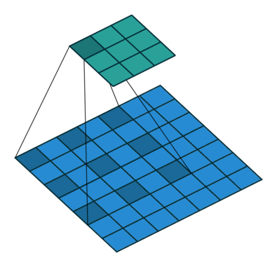

### Some Special Convolution

## Dilated Convolution 

### Effect:

Increase reception field.

Dilated Convolution (with dilated_rate > 1) can replace Convolution (with dilated_rate = 1) + Max Pooling to increase reception field without losing spatial information. 

### How it work 

**Ref** 

* https://towardsdatascience.com/review-dilated-convolution-semantic-segmentation-9d5a5bd768f5
* Multi-Scale Context Aggregation by Dilated Convolutions https://arxiv.org/abs/1511.07122

## Deformable Convolution 

### Effect

"The receptive field sizes of deformable filters are correlated with object sizes" 

### How it work

Ref:

* Deformable Convolutional Networks https://arxiv.org/abs/1703.06211  doi: 10.1109/ICCV.2017.89 

* https://towardsdatascience.com/review-dcn-deformable-convolutional-networks-2nd-runner-up-in-2017-coco-detection-object-14e488efce44